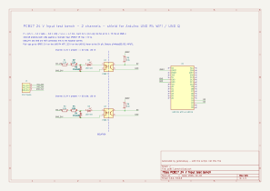
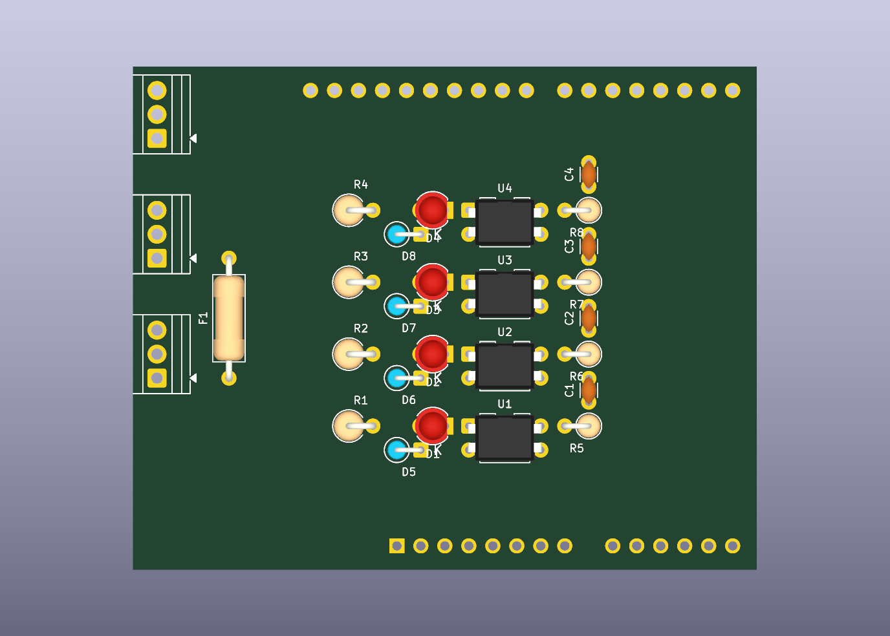

# Safety inputs for Arduino UNO: 2 e-stops + 2 lidars through PC817

An Arduino UNO shield with **four isolated 24 V inputs**: two emergency-stop buttons (one
normally-closed contact each) and two safety-lidar outputs. Each input goes through a PC817
optocoupler, so the 24 V side is electrically isolated from the microcontroller. It works unchanged on
the **UNO R4 WiFi** (5 V logic) and the **UNO Q** (3.3 V logic).

The KiCad schematic and board in this repository are **generated by Python scripts**. The scripts are
the source; the KiCad files are their output.





## The circuit

All four channels are the same; only the terminal wiring and the resistor value differ.

```
 e-stop:  24V ─[F1 T2A]─► ESn+ ──(button, NC)── ESn ─┐
 lidar:   lidar output (24 V when the zone is clear) ─ Ln ─┤
                                                      │
        ───[R]───┬─[LED]─► PC817 pin 1      pin 4 ─┬──────┬─ D2..D5
                 │                                  │      │
             [1N4148]                            [10k]   [C 100n, optional]
                 │                                  │      │
 0V ─────────────┴───────── PC817 pin 2           IOREF    │
                                             pin 3 ────────┴─ GND
```

| Pin | Input | Terminals | Series resistor (½ W) | Current |
|---|---|---|---|---|
| D2 | e-stop 1 | `ES1+`, `ES1` | R1 = 3.3 kΩ | 6.3 mA |
| D3 | e-stop 2 | `ES2+`, `ES2` | R2 = 3.3 kΩ | 6.3 mA |
| D4 | lidar 1 | `L1`, `0V` | R3 = 4.7 kΩ | 4.4 mA |
| D5 | lidar 2 | `L2`, `0V` | R4 = 4.7 kΩ | 4.4 mA |

| State | LED | Pin |
|---|---|---|
| Current flows: button released, or lidar zone clear | lit | **LOW = OK** |
| No current: button pressed, zone occupied, wire cut, connector unplugged, 24 V lost, fuse blown | off | **HIGH = stop** |

Every wiring failure reads as "stop".

- **The e-stop buttons are external.** The schematic draws them left of the terminal block, in a
  dashed box marked "EXTERNAL - not on the board": S1 between `ES1+` and `ES1`, S2 between `ES2+` and
  `ES2`, each with one normally-closed contact (two terminals). They are drawings only, so they
  appear in neither the netlist nor the board. Which button is front and which is rear is a choice
  made at installation; the sheet labels S1 front and S2 rear.
- **Terminal block J1**, top to bottom: `24V`, `0V`, `L1`, `ES2+`, `ES2`, `ES1+`, `ES1`, `L2`, `0V`.
  The order follows the channels on the board.
- **F1 (T2A)** protects the 24 V wires that leave the board for the buttons.
- **E-stop loops carry 6.3 mA** because switch contacts need a minimum current to stay reliable (often
  about 5 mA at 24 V; check the button's data sheet). A lidar output is electronic and needs none.
- **R1–R4 must be real ½ W parts** (body about 9 × 3.2 mm). At 28.8 V a 3.3 kΩ dissipates 0.20 W
  (40 % of ½ W) and a 4.7 kΩ 0.14 W (28 %). A ¼ W-size resistor (6 × 2.3 mm) sold as ½ W would run
  at 80 % of its real rating: measure the body before fitting. The 10 kΩ pull-ups R5–R8 dissipate
  2.5 mW; any rating will do.
- **C1–C4 (100 nF) are optional.** With the 10 kΩ pull-up they form a 1 ms filter on the rising
  (stop) edge: an opening shorter than about 1.5 ms never reaches the Arduino's HIGH threshold, and
  every real stop is seen about 1.6 ms later. Fitted, they remove contact bounce and a lidar's
  output test pulses in hardware; they also hide those short openings from the firmware, which can
  then no longer count them. Leave them out to observe the raw signal. The timing figures are
  calculated, not measured.
- The 1N4148 protects the LEDs against a reversed connection (the PC817 LED tolerates only 6 V).
- `0V` (24 V side) and `GND` (Arduino) are separate nets. Do not join them: that is the isolation.
  The lidars' 0 V must be connected to this board's `0V`.
- Each input is **single-channel**. A short across a button's two wires, or a shorted optocoupler
  output, reads as "OK" and is not detected. This is not a certified safety function.

## One board, two Arduinos

The pull-ups are tied to the header's **IOREF** pin, not to 5V. IOREF carries the logic voltage of
whichever board is plugged in, so the outputs swing to 5 V on a UNO R4 WiFi and to 3.3 V on a UNO Q,
with no jumper and no part change. The 24 V side is identical for both.

| | UNO R4 WiFi | UNO Q |
|---|---|---|
| Logic voltage (IOREF) | 5 V | 3.3 V |
| Pull-up current through 10 kΩ | 0.5 mA | 0.33 mA |
| Output LOW (PC817 saturated) | ≤ 0.2 V | ≤ 0.2 V |

Only pins that exist on every UNO-format board are used. The UNO Q figures come from its published
specification and have not been tried on hardware here: check the IOREF voltage with a multimeter
before plugging the bench onto a UNO Q.

## Repository layout

| Path | Content |
|---|---|
| `generate.py` | writes the schematic, project and symbol library in `kicad/`. Standard-library Python 3 |
| `generate_pcb.py` | writes the board `kicad/pc817_bench.kicad_pcb`: placement and routing. Needs KiCad's Python (`pcbnew`) |
| `kicad/` | generated KiCad project: open `pc817_bench.kicad_pro` |
| `docs/` | schematic (PDF, SVG), board layers (SVG), 3D view (PNG) |
| `firmware/pc817_two_inputs/` | Arduino sketch that prints every edge with its timing |
| `generate_protoboard.py` | writes `protoboard/`: the same circuit as a hole-by-hole build plan for a proto shield with isolated pads, checked against the schematic's netlist. Needs matplotlib |
| `protoboard/` | [BUILD.md](protoboard/BUILD.md) (parts, bridges, wires), `layout.png`, `layout.pdf` (1:1) |
| `check.sh` | regenerate everything, run KiCad's schematic and board rule checks, export `docs/` |

## Use

```bash
./check.sh     # needs kicad-cli and KiCad's Python, KiCad 9 or later
```

With the Flatpak build of KiCad:

```bash
KICAD_CLI="flatpak run --command=kicad-cli --filesystem=$PWD org.kicad.KiCad" \
KICAD_PYTHON="flatpak run --command=python3 --filesystem=$PWD org.kicad.KiCad" ./check.sh
```

To change the circuit or the layout, edit the scripts and run `check.sh` again. Edits made in the
KiCad editors are overwritten by the next run.

## The board

A two-layer, through-hole Arduino UNO shield, 66 × 53 mm, four channels at a 10 mm pitch.

- 24 V parts on the left, logic on the right. The gap under the optocouplers is the isolation
  barrier. One logic track (D5) runs in that gap on the solder side, 4.3 mm from the 24 V pins.
- Rows, top to bottom: lidar 1, e-stop 2, e-stop 1, lidar 2. This order lets each output reach its
  header pin without crossing another.
- The 9-way screw terminal (3.5 mm pitch) runs down the left edge with the fuse above it. On a
  UNO R4 WiFi this is above the USB-C connector, and the lowest terminals reach the power jack.
- Signal tracks are 0.5 mm, the fused 24 V tracks 1 mm. The 24 V return runs on the solder side.
- Part references of the resistors, diodes and optocouplers are printed under the parts.
- The optional capacitors stand right of the optocouplers, across pins 4 and 3.
- The library footprint `Module:Arduino_UNO_R3` is placed **flipped to the back side**, because a
  shield sits above the Arduino. Unflipped, the shield comes out mirrored. Its courtyard is removed,
  since the shield's parts are meant to be inside the Arduino's outline.
- Of the three GND header pins, the two on the power header are used.

## How the generators work

`generate_pcb.py` uses KiCad's `pcbnew` Python module: it loads the library footprints named in the
schematic, assigns nets from the exported netlist, places each part at fixed coordinates and adds
the tracks segment by segment. There is no autorouter.

`generate.py` uses no KiCad API. It writes KiCad's text file format (S-expressions) directly:

- the symbols (resistor, LED, diode, fuse, PC817, terminal block, Arduino UNO header) are defined in the script and embedded in the
  schematic, and also written to `kicad/bench.kicad_sym`;
- `place()`, `wire()`, `label()` and `junction()` append one schematic item each;
- `channel(k, y)` draws one complete input channel, and is called twice.

## Limits

- The board passes KiCad's design-rule check with default rules (one expected warning: the Arduino
  footprint differs from its library copy). **It has not been manufactured or assembled.** Before
  ordering, check the header orientation against a real Arduino using a 1:1 print, and the height of
  the terminal block's solder pins above the Arduino's connectors.
- No mounting holes, no test points, no copper zones.
- The files are written in the KiCad 7 format. KiCad 8 and later open them and show a notice that the
  file will be converted when saved. Checked with KiCad 10.0.6: loads, 0 rule-check violations.
- The Arduino is drawn as one symbol with the standard UNO shield header. Only IOREF, GND, D2 and D3
  are used; the other pins carry no-connect marks. Its pin numbers are the pad numbers of the library footprint.
- A shorted optocoupler output transistor also reads as "released", undetected.

## Datasheet

PC817: 4-pin DIP, pin 1 anode, 2 cathode, 3 emitter, 4 collector; current transfer ratio 50–600 % at
5 mA; isolation 5000 Vrms. Datasheets are available from Sharp and from second-source manufacturers.

## This branch: the proto-shield build

**On this branch the KiCad files describe a hand-built board, not a board to manufacture.** The circuit
is the one on `main`; three things differ so that it fits a proto shield with isolated pads on a
2.54 mm grid:

- resistors and the 1N4148 are mounted upright (2.54 mm footprints);
- the terminal block is 8-way at 5.08 mm, with one `ES+` screw shared by both buttons;
  the schematic on this branch draws both external buttons fed from that one screw;
- `kicad/pc817_bench.kicad_pcb` is a **model of the build**: parts on the grid, solder bridges and
  bare-wire runs as tracks on the solder side, insulated wires as lines on the `Cmts.User` layer.

| File | Content |
|---|---|
| [protoboard/BUILD.md](protoboard/BUILD.md) | parts with their holes, bridges, bare-wire runs, wires |
| `protoboard/layout.png`, `layout.pdf` | the plan as a drawing; the PDF prints at 1:1 |
| `generate_protoboard.py` | the plan itself; checks that the joined holes form the schematic's nets |
| `generate_pcb.py` | builds the KiCad model from the plan |

In KiCad's board editor the insulated wires appear as ratsnest lines, and the design-rule check
reports one "unconnected" item per wire plus one for the two GND header pins. That is expected;
`check.sh` verifies the count and that the model matches the schematic.

The plan is laid out for the **green ElectroCookie "Uno ProtoShield Universal"** and names every hole
by the column numbers printed on that board (1-20) and a row count from the printed edge. The hole
map was read from a photo and then confirmed on the real board (pad count, header pads, jack
clearance).

## Licence

MIT, see [LICENSE](LICENSE). It covers the script, the sketch and the generated KiCad files.
