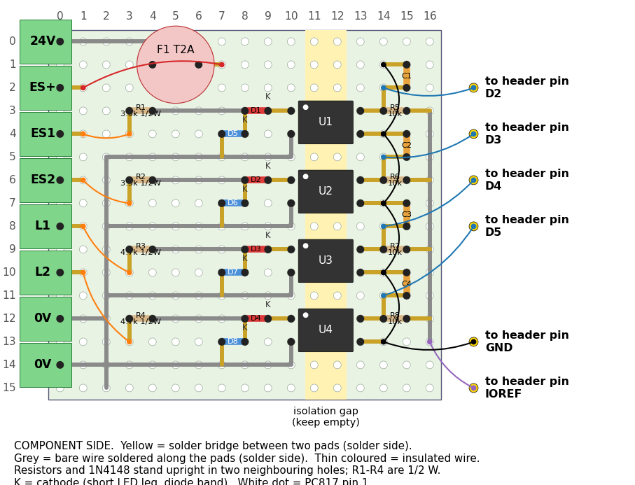

# Proto-shield build plan

For the green ElectroCookie *Uno ProtoShield Universal*. Generated by `generate_protoboard.py`.
The plan was checked against the schematic: the holes it joins form the same 21 nets as the
KiCad netlist, and every hole it uses exists on the board as mapped in the script.

## How holes are named

- Look at the **component side**, with the Arduino's USB end at the top.
- **Columns 1-20** are the numbers printed along the top edge.
- **Row 1** is the row next to those numbers; rows count downwards to 25.
- `layout.pdf` prints at 1:1 at 100 % scale.
- Rows 15 and 16 stay empty: they are the isolation gap under the optocouplers.
- Rows 1-5 of columns 2-5 are above the Arduino's power jack: nothing is soldered there.

## 1. Parts

| Part | Value | Holes | Note |
|---|---|---|---|
| R1 | 3.3k 1/2W | row 9, col 6; row 10, col 6 | stands upright; body on the first hole |
| D1 | LED | row 12, col 6; row 13, col 6 | first hole = anode (long leg) |
| D5 | 1N4148 | row 12, col 5; row 11, col 5 | stands upright; first hole = cathode (band) |
| U1 | PC817 | row 14, col 6; row 14, col 5; row 17, col 5; row 17, col 6 | holes in pin order 1, 2, 3, 4; pin 1 = dot |
| R5 | 10k | row 18, col 6; row 19, col 6 | stands upright; body on the first hole |
| C1 | 100n opt. | row 19, col 7; row 19, col 8 | optional; either way round |
| R2 | 3.3k 1/2W | row 9, col 9; row 10, col 9 | stands upright; body on the first hole |
| D2 | LED | row 12, col 9; row 13, col 9 | first hole = anode (long leg) |
| D6 | 1N4148 | row 12, col 8; row 11, col 8 | stands upright; first hole = cathode (band) |
| U2 | PC817 | row 14, col 9; row 14, col 8; row 17, col 8; row 17, col 9 | holes in pin order 1, 2, 3, 4; pin 1 = dot |
| R6 | 10k | row 18, col 9; row 19, col 9 | stands upright; body on the first hole |
| C2 | 100n opt. | row 19, col 10; row 19, col 11 | optional; either way round |
| R3 | 4.7k 1/2W | row 9, col 12; row 10, col 12 | stands upright; body on the first hole |
| D3 | LED | row 12, col 12; row 13, col 12 | first hole = anode (long leg) |
| D7 | 1N4148 | row 12, col 11; row 11, col 11 | stands upright; first hole = cathode (band) |
| U3 | PC817 | row 14, col 12; row 14, col 11; row 17, col 11; row 17, col 12 | holes in pin order 1, 2, 3, 4; pin 1 = dot |
| R7 | 10k | row 18, col 12; row 19, col 12 | stands upright; body on the first hole |
| C3 | 100n opt. | row 19, col 13; row 19, col 14 | optional; either way round |
| R4 | 4.7k 1/2W | row 9, col 15; row 10, col 15 | stands upright; body on the first hole |
| D4 | LED | row 12, col 15; row 13, col 15 | first hole = anode (long leg) |
| D8 | 1N4148 | row 12, col 14; row 11, col 14 | stands upright; first hole = cathode (band) |
| U4 | PC817 | row 14, col 15; row 14, col 14; row 17, col 14; row 17, col 15 | holes in pin order 1, 2, 3, 4; pin 1 = dot |
| R8 | 10k | row 18, col 15; row 19, col 15 | stands upright; body on the first hole |
| C4 | 100n opt. | row 19, col 16; row 19, col 17 | optional; either way round |
| F1 | T2A | row 6, col 6; row 6, col 8 |  |

Screw terminals, 5.08 mm pitch, along row 1, wire entry towards the top edge:

| Terminal | Hole |
|---|---|
| `24V` | row 1, col 6 |
| `ES+` | row 1, col 8 |
| `ES1` | row 1, col 10 |
| `ES2` | row 1, col 12 |
| `L1` | row 1, col 14 |
| `L2` | row 1, col 16 |
| `0V` | row 1, col 18 |
| `0V` | row 1, col 20 |

## 2. Solder side: bridges between neighbouring pads

| From | To |
|---|---|
| row 9, col 5 | row 9, col 6 |
| row 12, col 6 | row 12, col 5 |
| row 11, col 5 | row 11, col 4 |
| row 13, col 6 | row 14, col 6 |
| row 17, col 6 | row 18, col 6 |
| row 19, col 6 | row 20, col 6 |
| row 18, col 7 | row 18, col 6 |
| row 17, col 5 | row 18, col 5 |
| row 18, col 7 | row 19, col 7 |
| row 18, col 8 | row 19, col 8 |
| row 9, col 8 | row 9, col 9 |
| row 12, col 9 | row 12, col 8 |
| row 11, col 8 | row 11, col 7 |
| row 13, col 9 | row 14, col 9 |
| row 17, col 9 | row 18, col 9 |
| row 19, col 9 | row 20, col 9 |
| row 18, col 10 | row 18, col 9 |
| row 17, col 8 | row 18, col 8 |
| row 18, col 10 | row 19, col 10 |
| row 18, col 11 | row 19, col 11 |
| row 9, col 11 | row 9, col 12 |
| row 12, col 12 | row 12, col 11 |
| row 11, col 11 | row 11, col 10 |
| row 13, col 12 | row 14, col 12 |
| row 17, col 12 | row 18, col 12 |
| row 19, col 12 | row 20, col 12 |
| row 18, col 13 | row 18, col 12 |
| row 17, col 11 | row 18, col 11 |
| row 18, col 13 | row 19, col 13 |
| row 18, col 14 | row 19, col 14 |
| row 9, col 14 | row 9, col 15 |
| row 12, col 15 | row 12, col 14 |
| row 11, col 14 | row 11, col 13 |
| row 13, col 15 | row 14, col 15 |
| row 17, col 15 | row 18, col 15 |
| row 19, col 15 | row 20, col 15 |
| row 18, col 16 | row 18, col 15 |
| row 17, col 14 | row 18, col 14 |
| row 18, col 16 | row 19, col 16 |
| row 18, col 17 | row 19, col 17 |
| row 20, col 15 | row 20, col 16 |

## 3. Solder side: bare wire along a line of pads

| From | Through | To |
|---|---|---|
| row 10, col 6 | straight | row 12, col 6 |
| row 14, col 5 | row 14, col 4 | row 8, col 4 |
| row 10, col 9 | straight | row 12, col 9 |
| row 14, col 8 | row 14, col 7 | row 8, col 7 |
| row 10, col 12 | straight | row 12, col 12 |
| row 14, col 11 | row 14, col 10 | row 8, col 10 |
| row 10, col 15 | straight | row 12, col 15 |
| row 14, col 14 | row 14, col 13 | row 8, col 13 |
| row 8, col 4 | straight | row 8, col 17 |
| row 1, col 18 | row 6, col 18; row 6, col 17 | row 8, col 17 |
| row 1, col 20 | row 4, col 20 | row 4, col 18 |
| row 1, col 6 | straight | row 6, col 6 |
| row 6, col 8 | straight | row 1, col 8 |
| row 1, col 10 | straight | row 4, col 10 |
| row 1, col 12 | straight | row 4, col 12 |
| row 1, col 14 | straight | row 4, col 14 |
| row 1, col 16 | straight | row 4, col 16 |
| row 20, col 6 | straight | row 20, col 15 |

## 4. Component side: insulated wires

| From | To | Purpose |
|---|---|---|
| row 18, col 7 | header pad **D2** (row 23, col 19) | output |
| row 18, col 10 | header pad **D3** (row 22, col 19) | output |
| row 18, col 13 | header pad **D4** (row 21, col 19) | output |
| row 18, col 16 | header pad **D5** (row 20, col 19) | output |
| row 4, col 10 | row 9, col 5 | input |
| row 4, col 12 | row 9, col 8 | input |
| row 4, col 14 | row 9, col 11 | input |
| row 4, col 16 | row 9, col 14 | input |
| row 20, col 16 | header pad **IOREF** (row 12, col 2) | logic supply reference |
| row 18, col 5 | row 18, col 8 | logic GND |
| row 18, col 8 | row 18, col 11 | logic GND |
| row 18, col 11 | row 18, col 14 | logic GND |
| row 18, col 14 | row 18, col 17 | logic GND |
| row 18, col 5 | header pad **GND** (row 16, col 2) | logic GND |

## 5. Checked on the real board (2026-10-05)

1. Pad count matches the drawing: 20 columns in rows 1-4, 14 columns (4 to 17) in rows 11-25.
2. Each inner pad beside a header pin is joined to that pin (multimeter).
3. The 24V terminal pin at column 6 clears the Arduino's power jack.

## 6. Before applying 24 V

1. No continuity between any `0V` terminal and the Arduino `GND` pin.
2. No continuity between the `24V` or `ES+` terminal and any header pin.
3. Diode test across each PC817 pins 1-2: a reading one way (LED), about 0.6 V the other (1N4148).
4. Fuse fitted; `24V` to `ES+` reads near 0 Ω.
